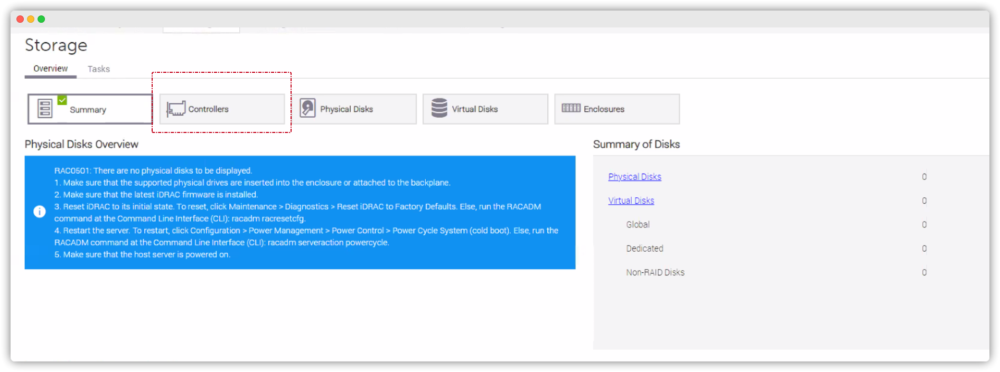

<!-- _class: title -->

# Your Title Goes Here

Your subtitle

**VxRail Licenses - Importing Embedded Licenses**

by: your name

Date, time and place

---

# Your Title Goes Here
## Contents

1. One
2. Two
3. Three
4. Four
5. Five

---

# Your Title Goes Here
## One

Some example image:



---

# Your Title Goes Here
## Two

Some example code:

```python
import sys, os

def hello(name):
  print("Hello, ", name)

if __name__ == '__main__':
  main()
```

---

<!-- _class: title -->

# The End

Thanks for your time and hope this helps!

by your name.
